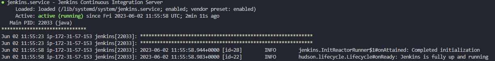
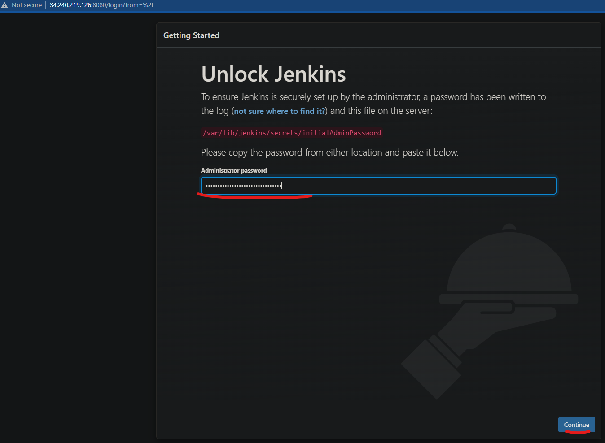
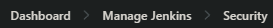
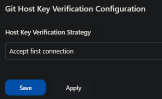
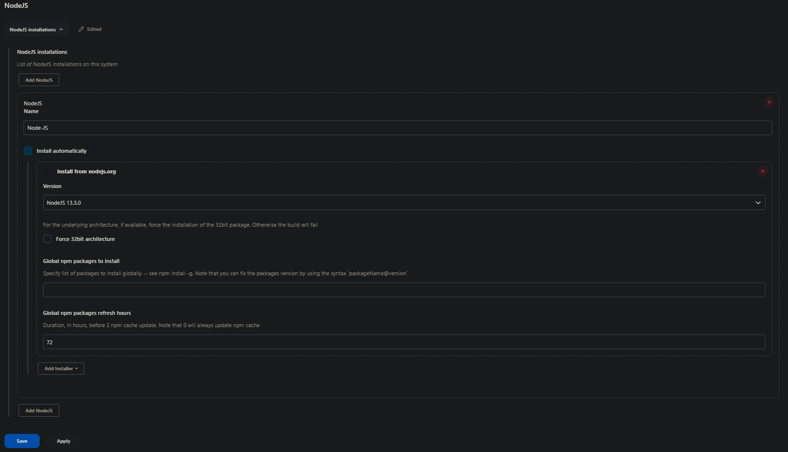

1. Make 22.04 server with security settings to allow http, ssh and port 8080(jenkins) and launch ec2 and run the following commands:

```bash
sudo apt update && sudo apt upgrade -y
```

```bash
curl -fsSL https://pkg.jenkins.io/debian-stable/jenkins.io-2023.key | sudo tee   /usr/share/keyrings/jenkins-keyring.asc > /dev/null
```

```bash
echo deb [signed-by=/usr/share/keyrings/jenkins-keyring.asc]   https://pkg.jenkins.io/debian-stable binary/ | sudo tee   /etc/apt/sources.list.d/jenkins.list > /dev/null
```

```bash
sudo apt-get update
```

```bash
sudo apt install default-jre
```

```bash
sudo apt-get update
```

probably not needed - 

```bash
sudo apt upgrade -y
```

```bash
sudo apt-get install jenkins
```

```bash
sudo systemctl enable jenkins
```

```bash
sudo systemctl start jenkins
```

can check status using : 

```bash
sudo systemctl status jenkins
```

# Setting up Jenkins


you can now navigate to ip:8080 to access the 

1. You can get the admin password using:
```bash
sudo cat /var/lib/jenkins/secrets/initialAdminPassword
```
2. Setup a first admin username and password, note these down.
3. Download recommended plugins.
4. Then download recommended configuration and install the following plugins: `Amazon EC2`, `NodeJS` and `SSH Agent`

5. Change a setting in


6. Then change settings in

