# Pipe 1 - Run automated tests on pushed code
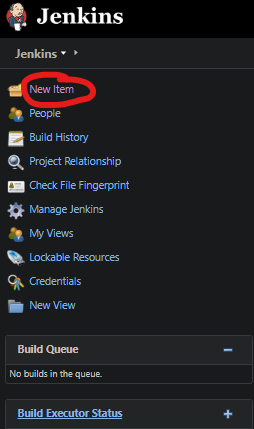
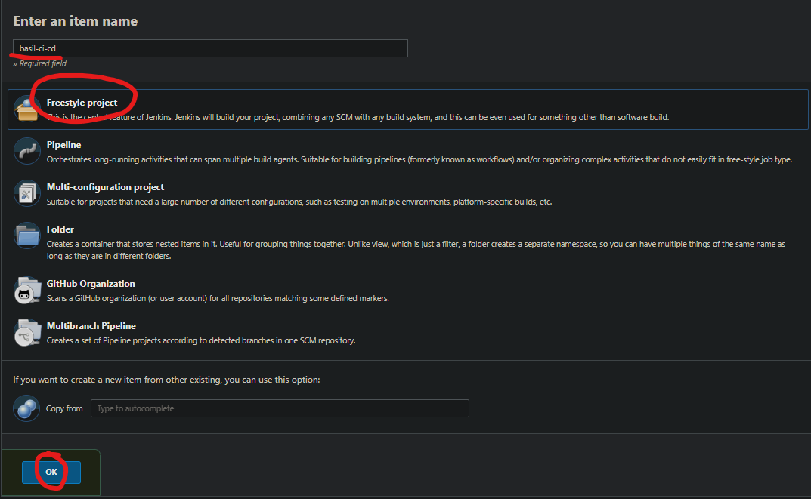
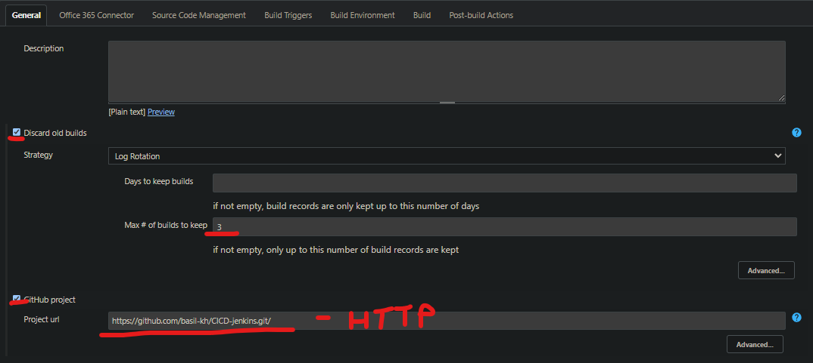
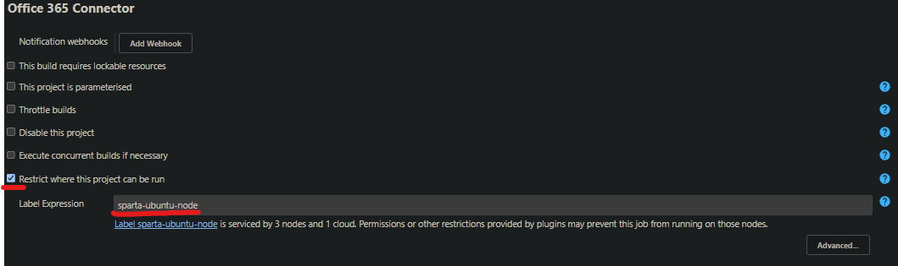
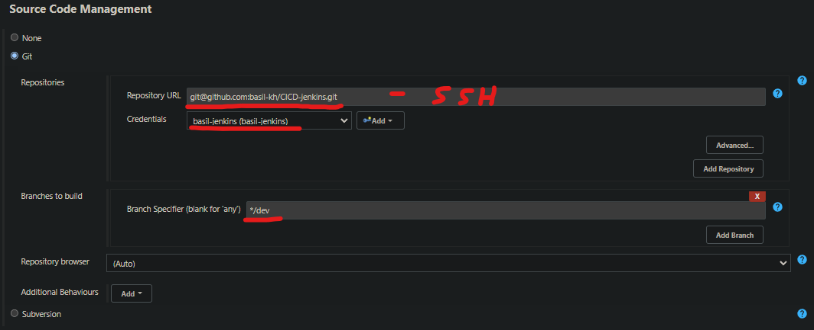

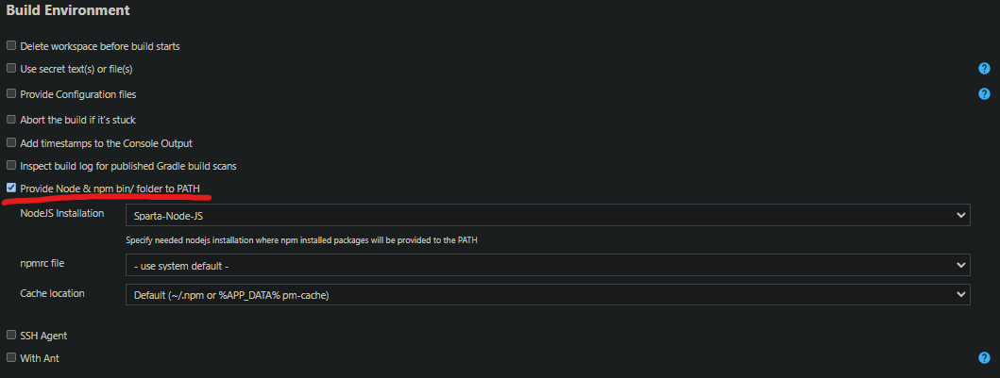
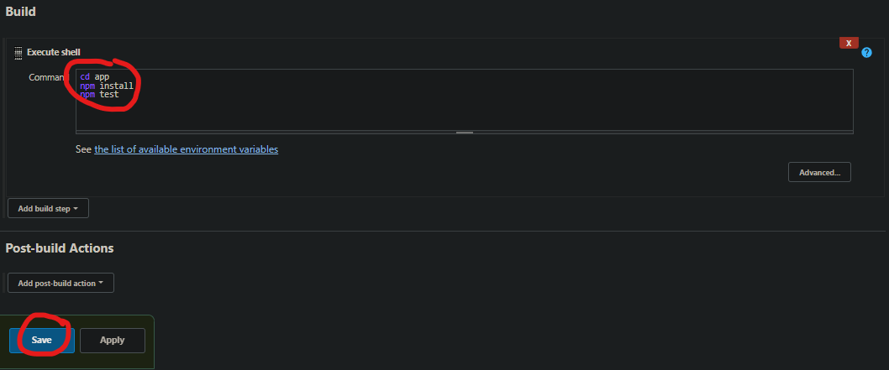

# Pipe 2 - Merge dev branch to main

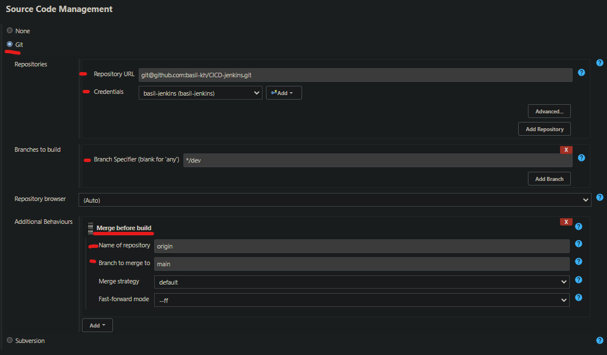
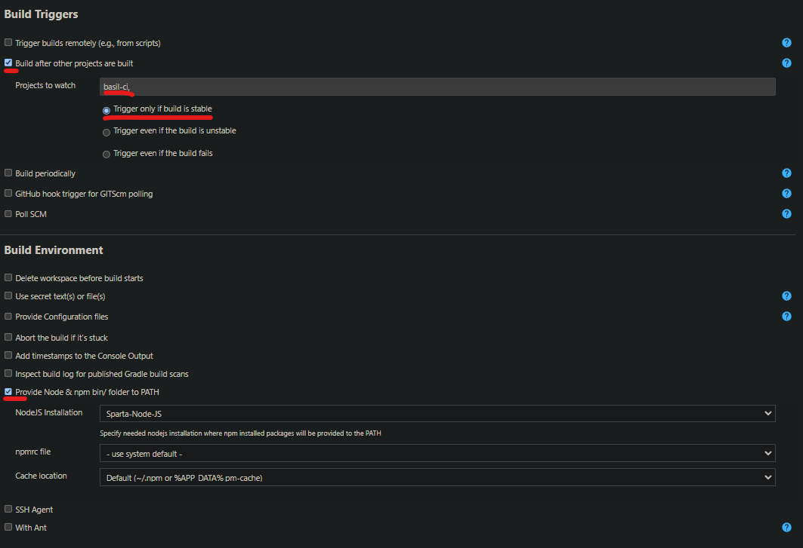
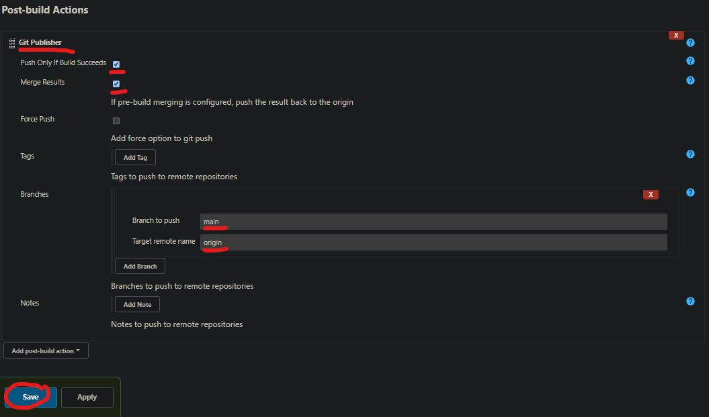

# Pipe 3 - Push changes to app and run

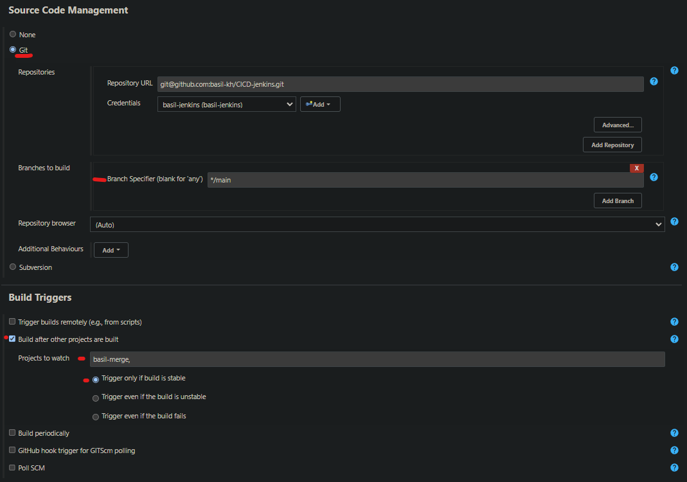

If all goes smoothly, you can try to change some words in the app folder and see if the changes appear on your webpage like so : 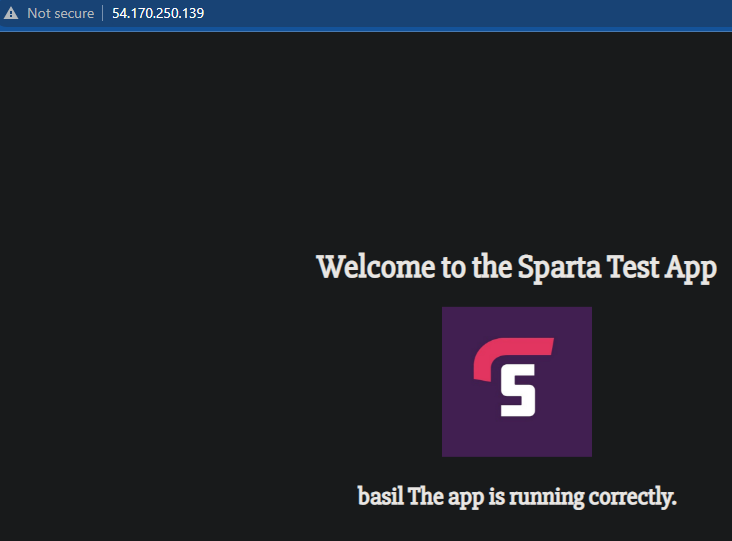

