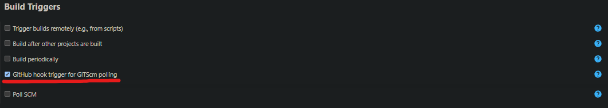
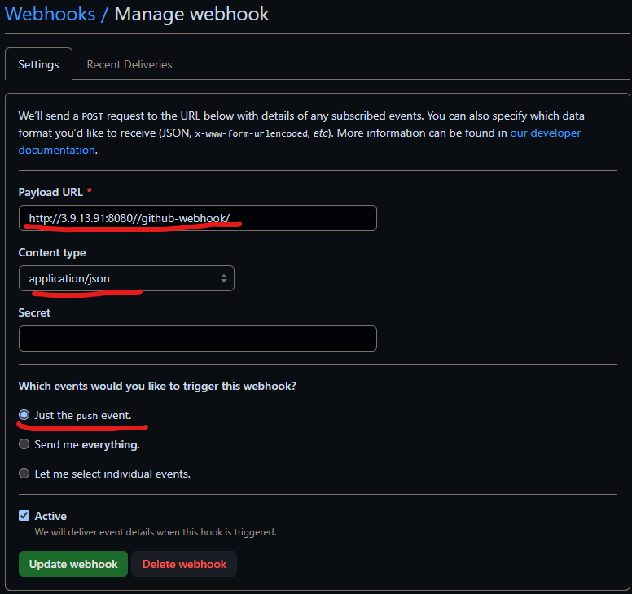
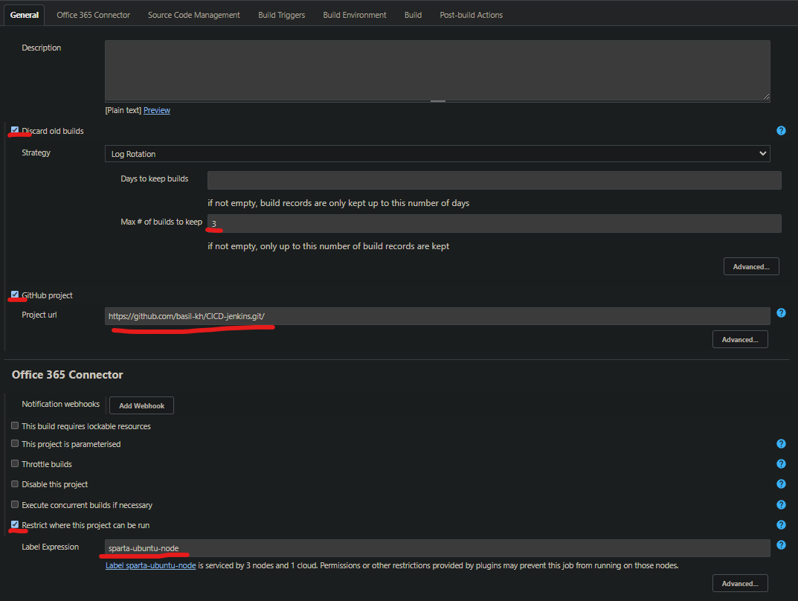
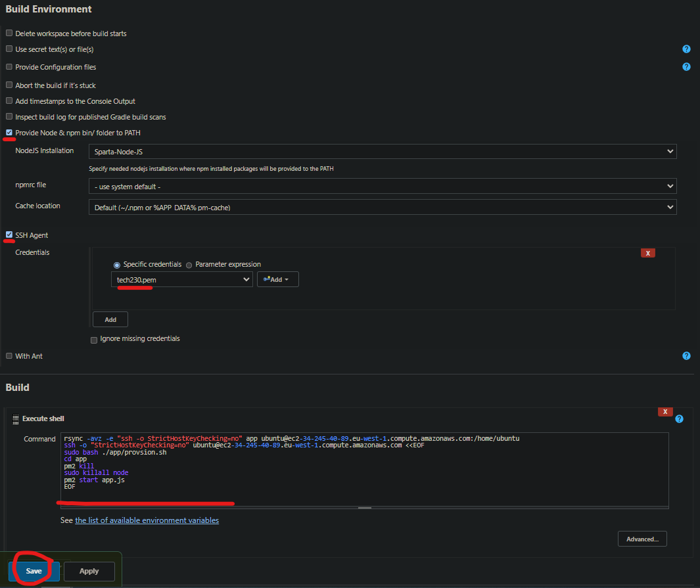

# Pipe 1 - Run automated tests on pushed code

# Setting up webhook on github

# Pipe 2 - Merge dev branch to main

# Pipe 3 - Push changes to app and run

## General and office 365 connector Settings same as pipe 2.
Back on main branch as the previous job should have merged dev into main.

The pem can be added to jenkins in a similiar way as the github SSH private key

If all goes smoothly, you can try to change some words in the app folder and push to dev branch and see if the changes appear on your webpage like so : 

5

