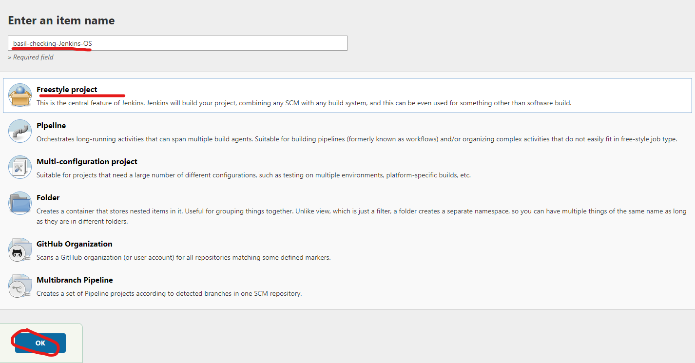

# What is Jenkins
Jenkins is a popular open-source automation server, primarily used for continuous integration and continuous delivery (CI/CD) in software development. It helps to automate the parts of software development related to building, testing, and deploying, which facilitates continuous integration and continuous delivery.

Jenkins is written in Java and provides a platform that can be used with any programming language and source code repository. Jenkins can be run as a standalone application or deployed on a server that communicates with version control system like Git.

The tool supports plugins, which means its functionality can be extended for almost any need. There are hundreds of plugins available in the Update Center, covering different aspects of software development, from building and testing to delivering applications. Jenkins can be configured to distribute tasks across multiple machines for faster builds, tests, and deployments across platforms.

Jenkins is a widely used tool in DevOps because it facilitates collaboration between developers and operations teams, making the software development process more efficient and standardized.
# Jenkins diagram

1. Code is pushed via SSH to github
2. A webhook trigger alerts Jenkins and then the code is cloned from github onto Jenkins
3. Jenkins uses **Agent Node** to test the code and if no errors the code is passed to **Master Node**. if **any** tests fail then the code is sent back with feedback.
4. **Master Node**  then pushes the code to AWS servers via SSH, it can do continuous delivery (just push the code to prod server, but leave the deployment to be done manually (node app.js)), or continuous deployment where it pushes the code and runs node app.js. There are advantages and disadvantages to both.

# Jenkins Alternatives:

1. CircleCI: This is a cloud-based system that supports many languages and is easy to set up with existing platforms like GitHub.

2. Travis CI: Travis CI is another cloud-based service that integrates well with GitHub. It's used for automating tests and deployments. It's free for open-source projects.

3. GitLab: GitLab, a web-based DevOps lifecycle tool, provides its own CI/CD service. It is deeply integrated with GitLab's version control system and offers a unique "auto DevOps" feature that can automatically set up CI/CD pipelines with minimal configuration.

4. TeamCity: Developed by JetBrains, TeamCity is a Java-based CI/CD server that supports a wide range of tools and frameworks. It's well known for its user-friendly interface.

5. Azure DevOps: Microsoft's Azure DevOps provides a suite of development collaboration tools, including CI/CD functionality. Azure Pipelines, part of Azure DevOps, supports a wide range of languages, platforms, and cloud providers.

# Creating jenkins task

# Chaining 2 tasks

# Connecting task to github repo using SSH

# Setting up webhook on github

# After a push it should run the tests automatically like so:

t